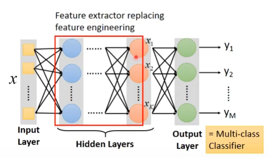
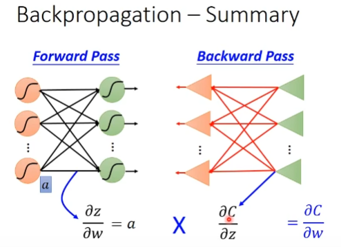
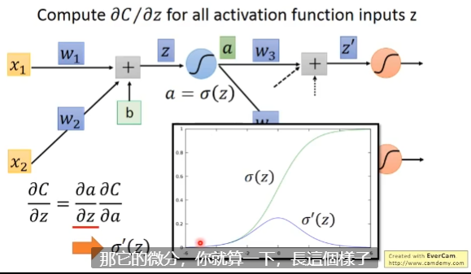
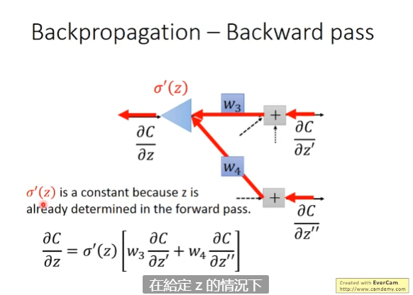

# Deep Learning
1958 Perceptron (linear model)

1980s Multi-layer perceptron

1986 Backpropagation

RBM intialization

09 GPU

### network structure == function set
Fully Connect Feedforwarc Network

input layer
hidden layar
output layer

## LOSS FOR AN EXAMPLE
cross entropy

# Backpropagation
比较有效率的演算法

Chain Rule
拆分偏微分
## forward pass

## Backward pass

前后向是一样