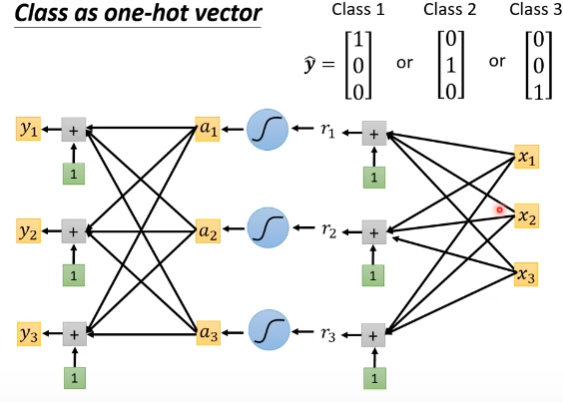
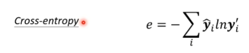
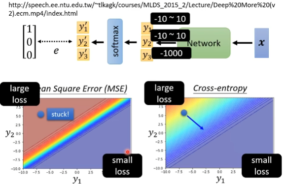
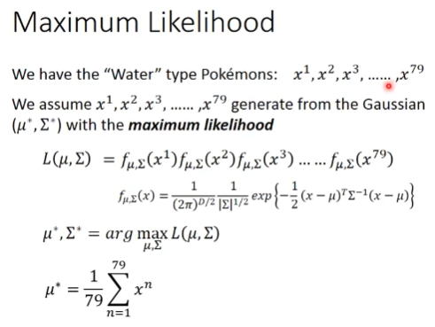
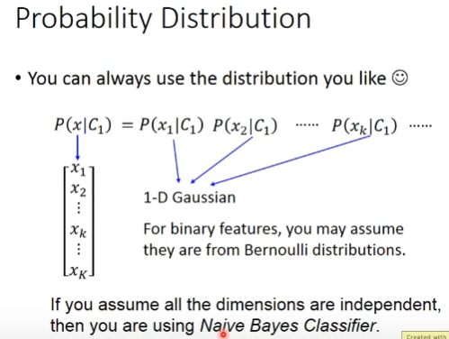
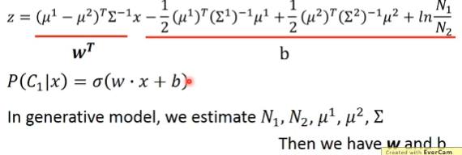
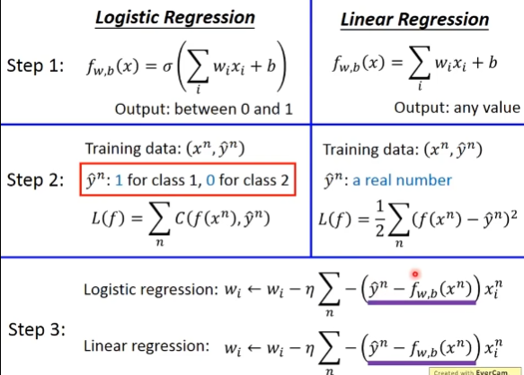
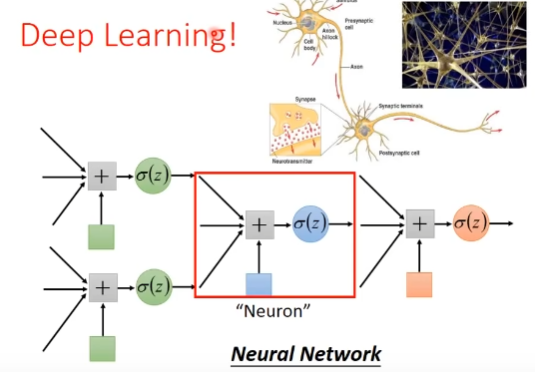

# Classification
Classification as Regression?NO

class as one-hot vector

## softmax
1. nomalize
2. logit
## loss of Classfication
cross-entropy == MAXMIZEING LIKELIHOOD

cross-entropy 和 softmax绑定pytorch自动加

# GAUSSIAN DISTRIBUTION
maximum likelihood to find gaussion distribution

## Modifying Model
the same covariance
## Three Steps:
1. Function Set
2. Goodness of a function
3. find the best fun

# Logistic Regression
cross entropy

Generative vs Discriminative

# Multi-class Classification
Softmax
# Limitation of Logistic Regression
1. Feature Transformation
2. cascading logistic regresssion models

