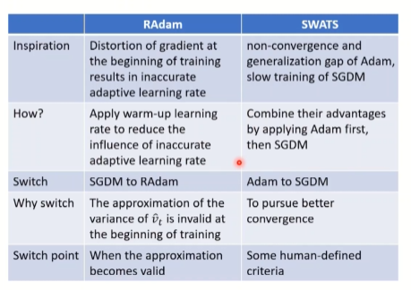
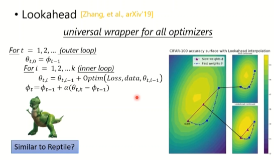
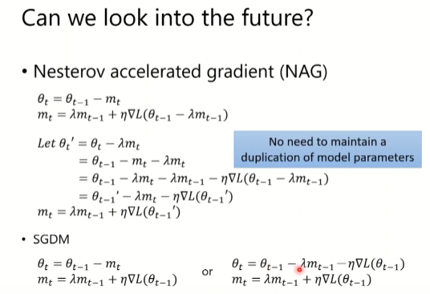
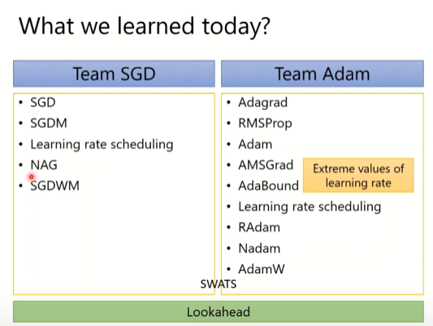
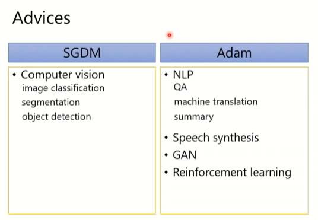

on-line vs off-line
## SGD
grad 反方向 
## SGDM
SGD + Momentum
## Adagrad
RMS 调整grad
## RMSProp
## Adam
SGDM + RMSProp

# Conmbine Adam with SGDM 
SWATS
# Towards Improving Adam
## AMSGrad
2018
## AdaBound
2019
# Towards Improving SGDM
## Cyclical LR
2017
## SGDR
2017
## One-cycle LR
2017
# Does Adam need warm-up?
Of Course!
Distorted gradient
RAdam

 
## Lookahead
k step forward, 1 step back

### Nestero accelerated gradient (NAG)

## Nadam

# L2 regulization or weight decay?

## AdamW
## SGDWM

# Somethoning helps optimizations
1. Shuffling
2. Dropout
3. Gradient noise
4. warm-up
5. curriculum learning
6. fine-tuning
7. normalization
8. regulatization

