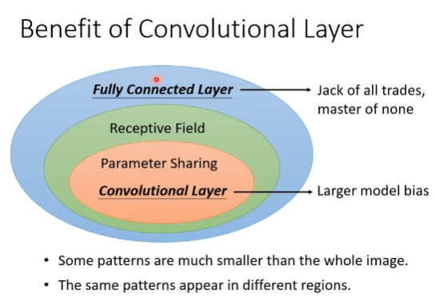
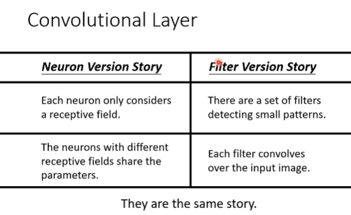

# Convolutional Neural Network
Image Classification

Tensor

## Receptive field
Typical Setting

1. kernel size
2. stride
3. overlap
4. padding

## Parameter sharing

1. filter

### Another story
1. Feature Map
2. Multiple Convolutional Layers

## Subsampling 
Pooling

1. MAX pooling

## the whole CNN

Conv + Pool + Conv + Pool + flatten + fully connected layer

CNN IS NOT INVARIANT TO SCALING AND ROTATION!!!

## More Applications
