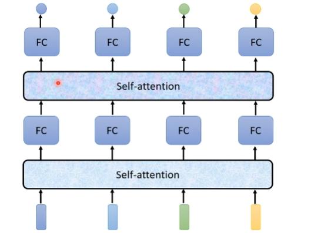
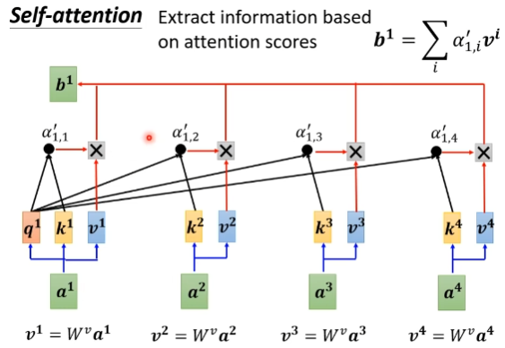
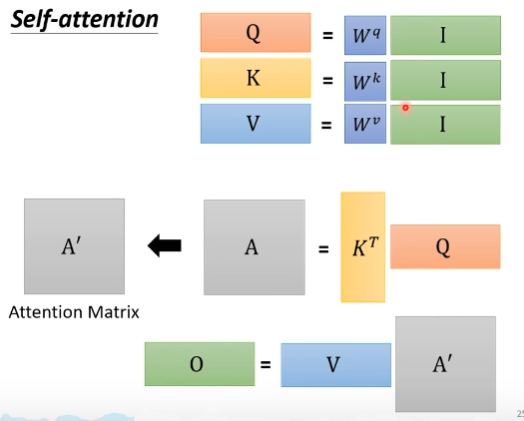

# Self-attention
Sophisticatedd Input

## vector set as input
1. one-hot encoding
2. word embedding
3. voice
    
    frame 25ms 1s->100frames
4. graph

## what is the output?
1. each vector has a label
   
   pos tagging
2. The whole sequence has a label
   
   sentiment analysis
3. Model decides the number of labels itself

    seq2seq

## Sequence Labeling

Dot-product/additive
attention score

Multi-head Self-attention

## Positonal encoding
no position information in self-attention

each position has a unique positional vector e

hand crafted

learn from data
## Truncated Self-attention
## self-attention for image
image as a vector set
# cnn is a simplified self-attention

# Self-attention vs RNN

RNN nonparallel
# Self-attention vs Graph
Graph Neural Network(GNN)

# Efficient transformer