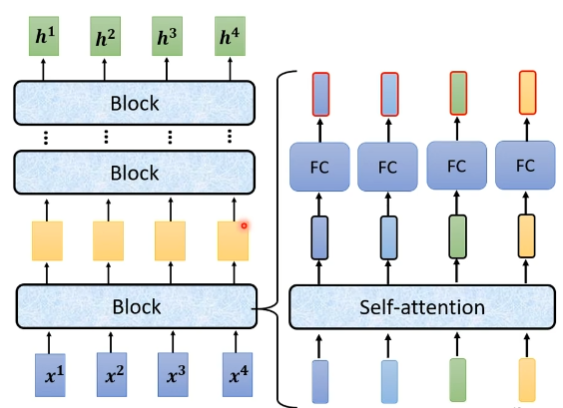
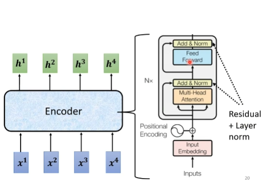
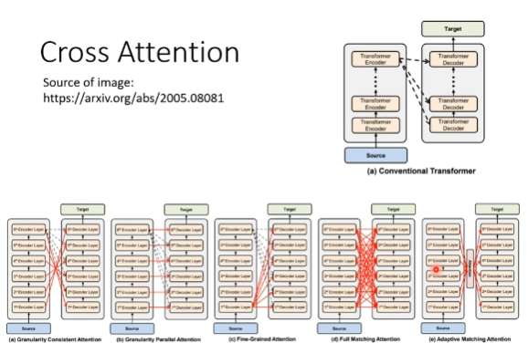
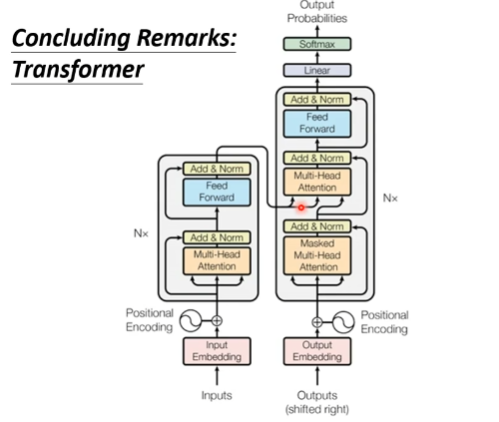
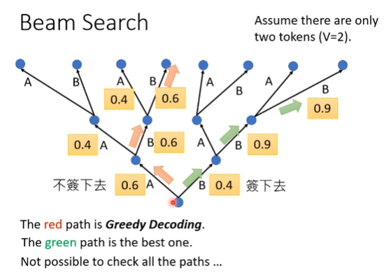

# Sequence to sequence
1. Speech Recognition
2. Machine Translation
3. Speech Translation
4. Text-to-speech synthesis

Seq2seq for chatbot

QA can be done by seq2seq

seq2seq for syntactic parsing

seq2seq for multi-label classification

seq2seq for object detection
## seq2seq
## Encoder
self-attention

residual 

layer norm

 

## Decoder
### Autoregressive
Masked Self-attention
We do not know the correct output length? Begin & End
### Non-autoregressive 
How to decide the output length

Another prefictor for output length

parallel controllable output length

NAT is usually worse than AT
### Cross attention

## Training
minimize cross entropy

Decoder input Ground Truth (MISS MATCH)

## Tips
### Copy Mechanism
chat-bot
summarization
### Guided attention
monotonic attention
### Beam Search
Greedy Decoding

Randomness is needed for decoder when generating sequence in some task

## Optimizing Evaluaton Metrics
BLEU score && cross entropy

## Exposure bias
Scheduled Sampling

## conformer