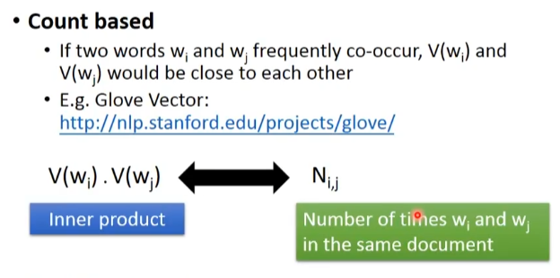
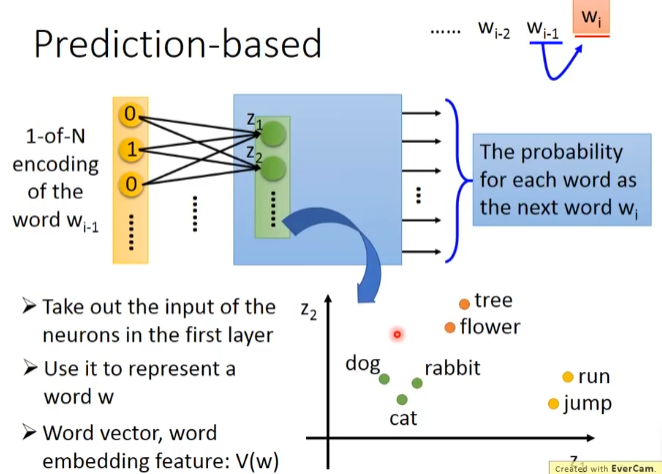
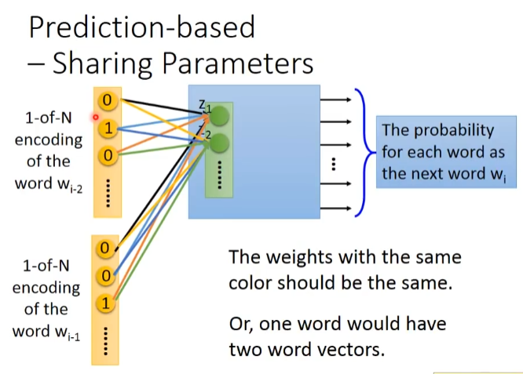
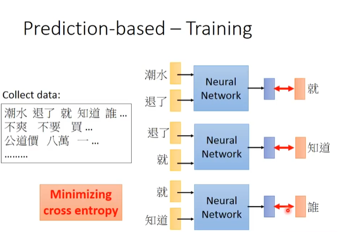
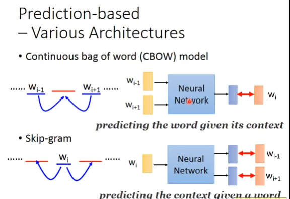

# Word Embedding
1 of N Encoding

word class

word embedding

how about auto-encoder?NO

## How to exploit the context?
1. count based
   
   
2. Prediction based

    

    Prediction-based -- Sharing Parameters

    

    Word embedding == W * 1 of N
    1. Training
        
    2. Various Architecures
       1. continuous bag of word model
       2. skip-gram
        

## Multi-lingual Embedding
## Multi-domain Embedding
zero-shot
## Doument Embdding
## Beyond Bag of Word 