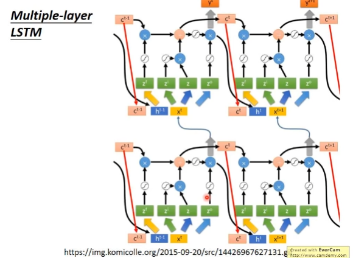

# Recurrent Neural Network (RNN)
1. slot filling
2. word washing

## memory
given initial values  

### Elman Network &  Jordan Network

### Bidirectional RNN

# Long Short-term Memory (LSTM)

4 inputs, 1 outputs

Simply replace neural with LSTM

4 TIMES OF PARAMETERS

LSTM GRU SimpleRNN