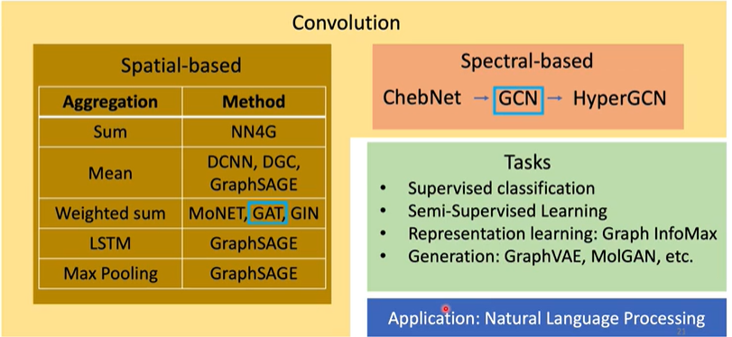
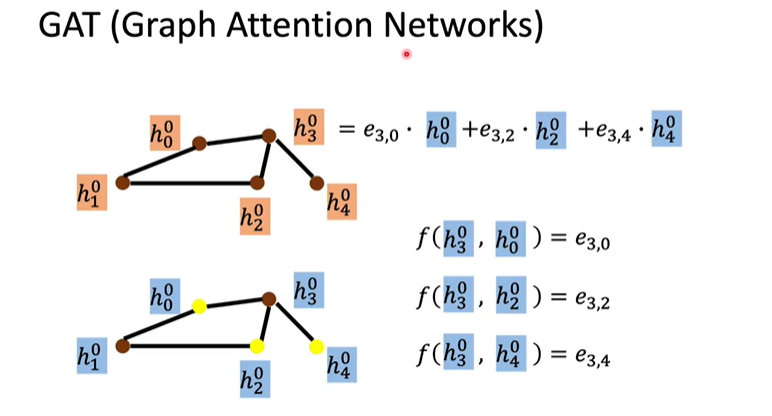
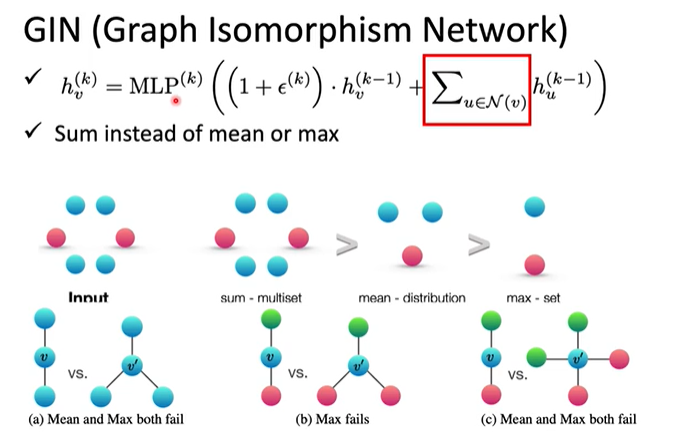

# Graph Neural Network
1. Classificaton
2. generation
## Convolution 

# Spatial-based GNN
### Terminology
1. Aggrerate
2. Readout

## NN4G
Embedding
Aggrertion
Readout
## DCNN(Diffusion-Convolution Neural Network)
## DGC
## MoNET(Mixture Model Networks)
## GraphSAGE
AGGREGATION max,mean,LSTM
## GAT(Graph Attention Networks)

## GIN(Graph Isomorphism Network)

多层感知器（MLP，Multilayer Perceptron）是一种前馈人工神经网络模型，其将输入的多个数据集映射到单一的输出的数据集上.
# Spectral
## spectral-Based Convolution
### N-dim Vector Space
### Fourier transform 
### Discrete time foureier basis
频率越大相邻两点变化越大