# Network as Generator 

1. Video Prediction
2. the same imput has different outputs.
3. Drawing
4. Chatbot

# Generative Adversarial Network (GAN)
ALL KIND OF GAN

1. unconditional generation
   

## Discriminator
DESIGN BY YOURSELF

## Basic Idea of GAN

## Algorithm
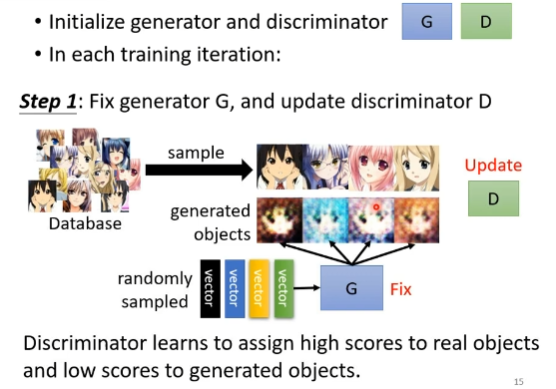

## Theory
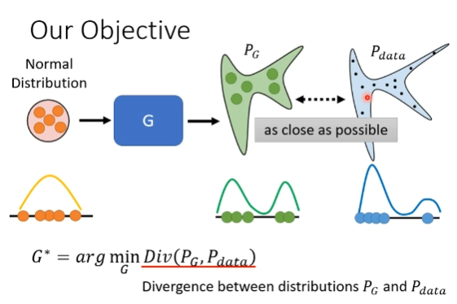

Sampling is enough

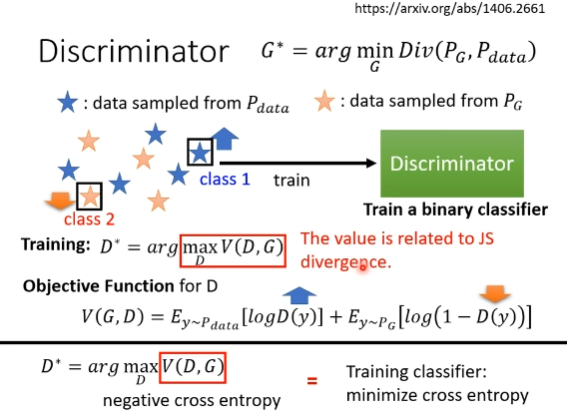

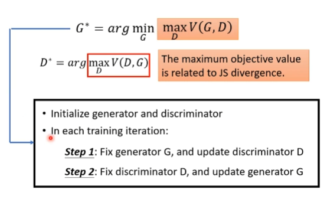

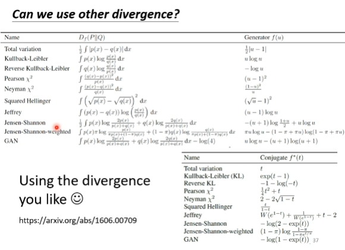

### JS divergence problem

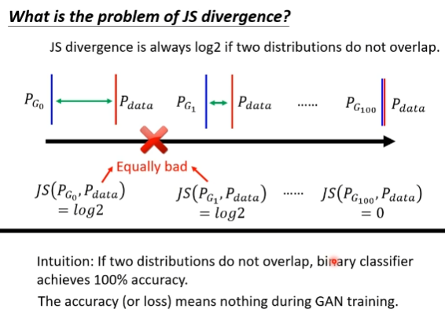

### Wasserstein distance
穷举取最小

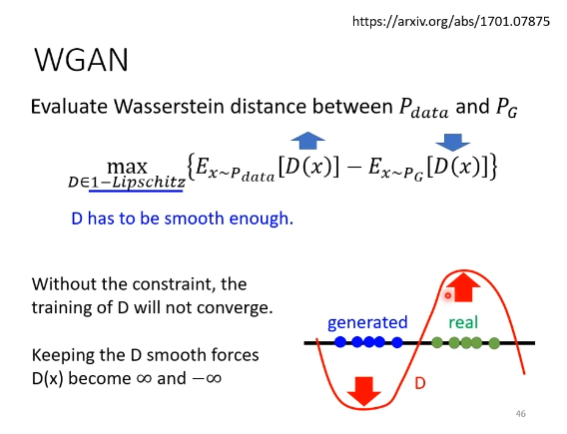

## Quality of Image

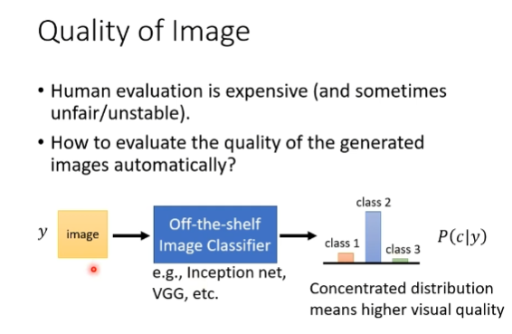

### Diversity - Mode Collapse
### Diversity - Mode Dropping
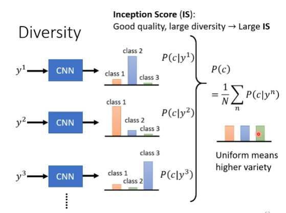

### Inception IS
### Frechet Inception Distance(FID)
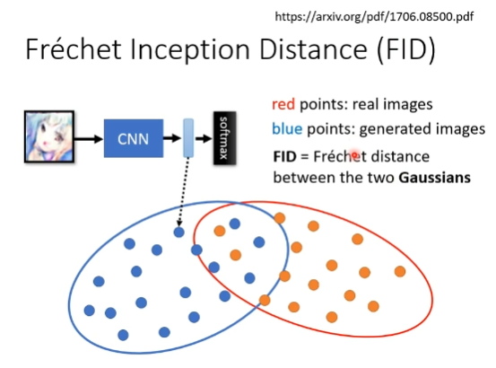

# Conditional GAN

# Learning from unpaired data
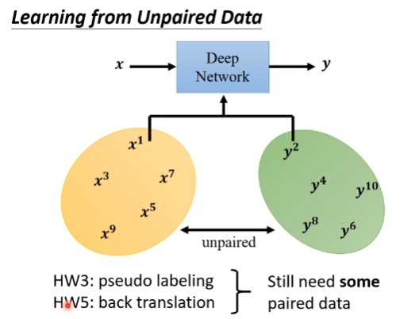
## Cycle GAN

### text style transfer
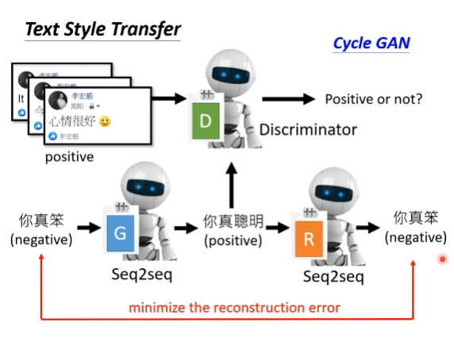

# OLD 
# PixelRNN
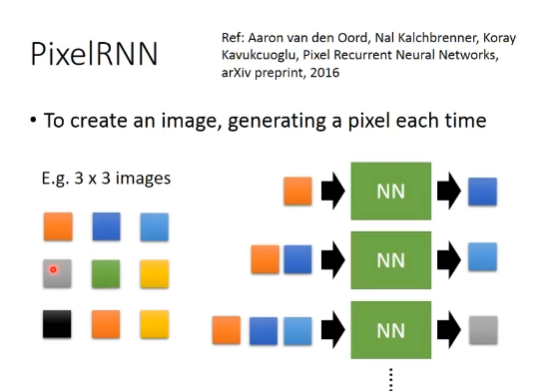
# VAE
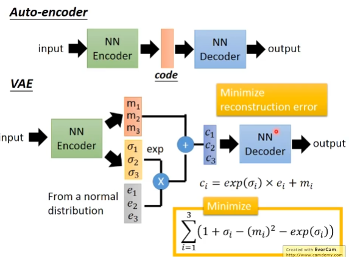