# Self-Supervised Learning
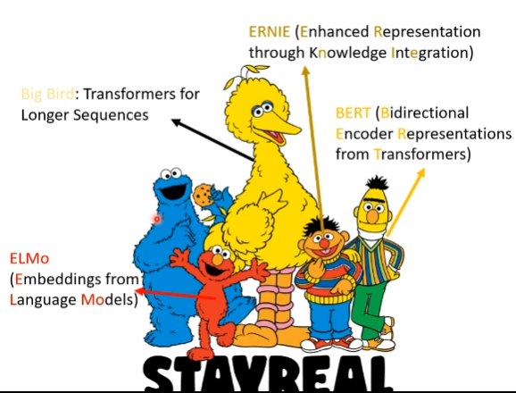
BERT GPT
### mask input
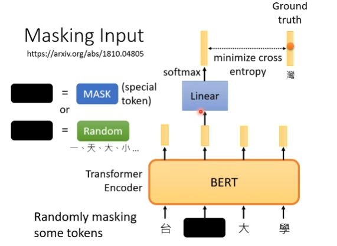
### Next Sentence Predicton

### Sentence order prediction (SOP)

## Downstream Tasks

Fine-tune

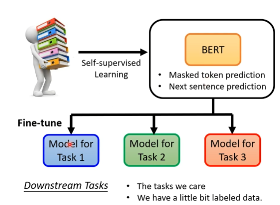

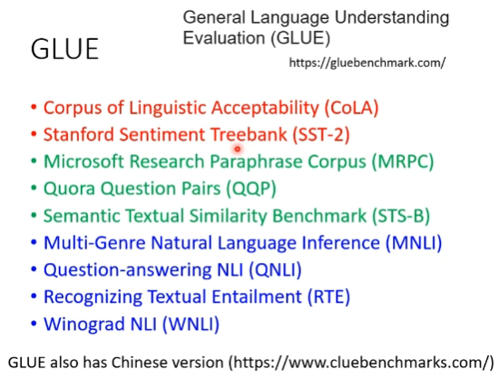

## How to use BERT

semi-supervised

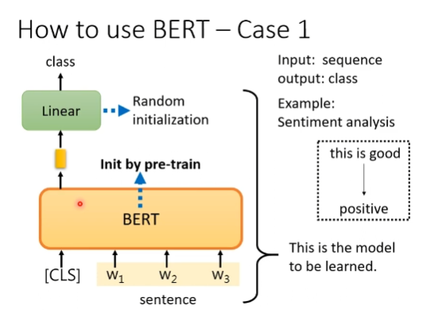
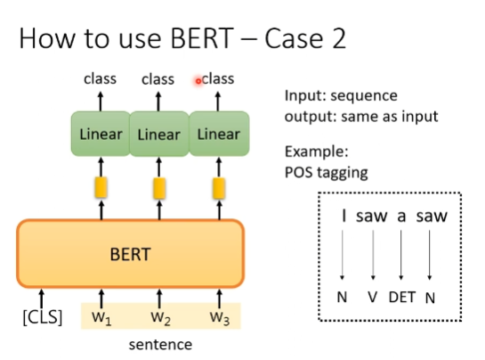
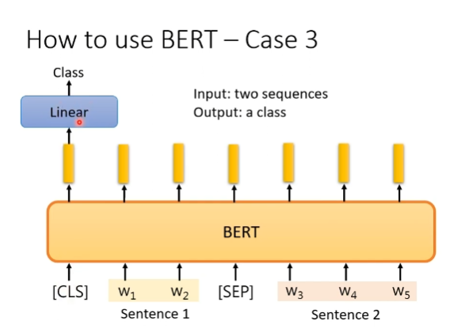
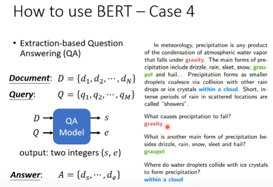
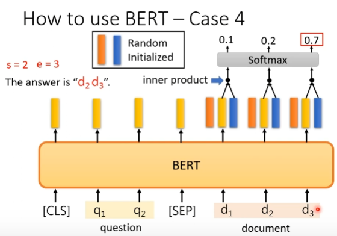

## training bert is challenging!
BERT Embryology

### Pre-train seq2seq model

## Multi-Lingual BERT
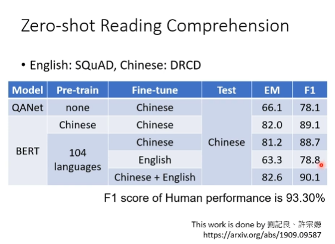

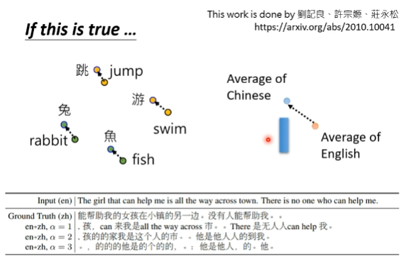

# GPT
## Predice Next Token

## Few-shot learning
in-context learning

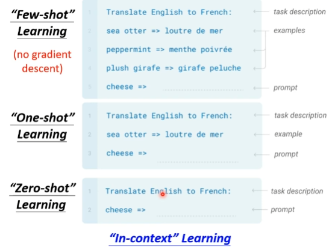