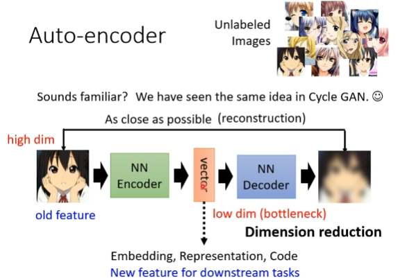
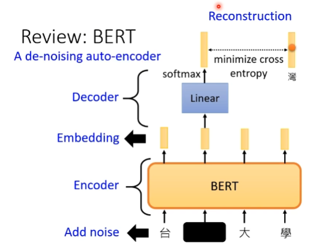
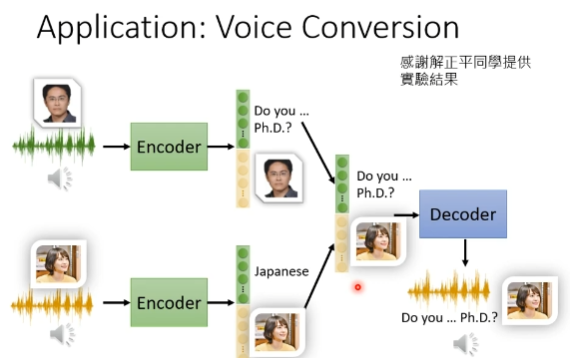
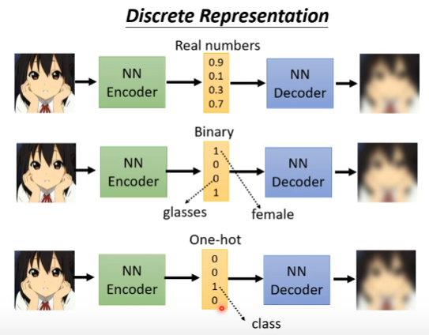
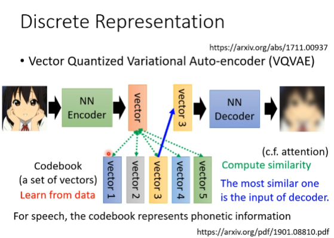
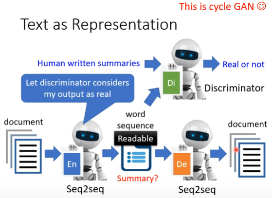
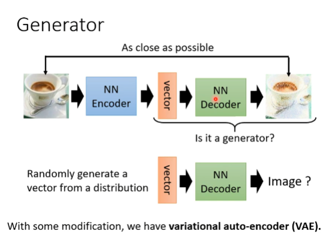
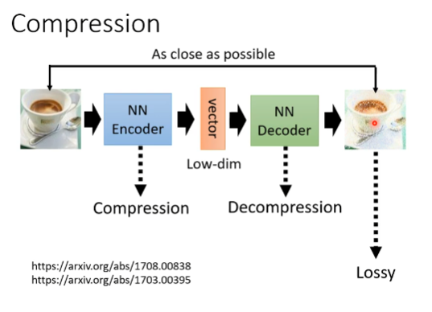

# self-supervised learning framework
# Auto-encoder

More Dimention Reduction 

auto-encoder is not a new idea

## De-noising Auto-encoder

## Feature Disentangle

### Application Voice Conversion

## Discrete Representation

## Anomaly Detection
