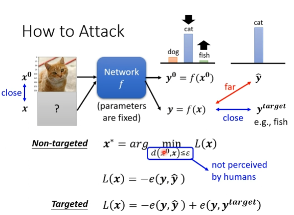
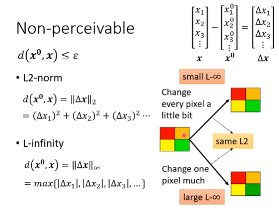
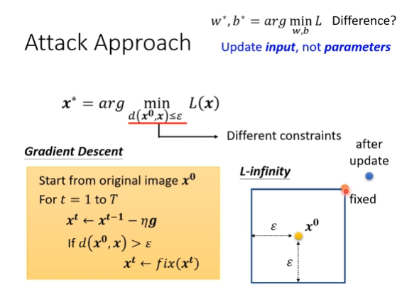
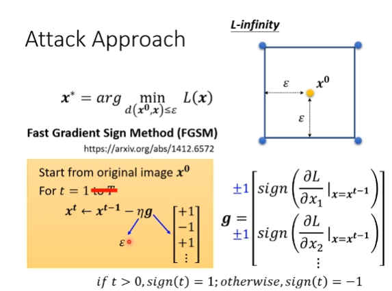

# Adversarial Attack
example of attack
1. non-targeted
2. targeted
## How to attack

### Non-perceivable

Need to consider human perception

# White Box v.s. Black Box
## Black Box Attack
if we know the training data:

Network Black -  Network Proxy

The attack is  so easy! Why?

to learn more: Adversarial Examples are not bugs, they are features

1. One pixel attack
2. Universal Adversarial Attack

## Beyond Images
1. Speech processing: Detech synthesized speech
2. Natural Language Processing

## Attack in the Physical World

## Adersarial Reprogramming

## "Backdoor" in Model

# Defense
## Passive Defence
1. smoothong
2. image compression
3. generator
4. Randomization
## Proactive Defense
1. Adversarial Training
   
   data augmentation

