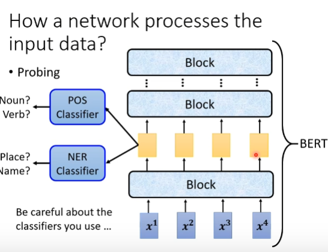
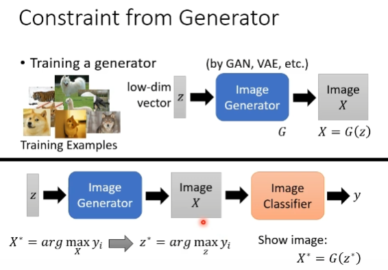

# Explainable ML
Why we need Explainable ML?

Interpretable Powerful
## Local Explaincation
1. component importance
   saliency map
   
   noisy Gradient
   gradient saturation

2. visualization
3. probing
   

## Global Explaincation
Constraint from Generator

### LIME