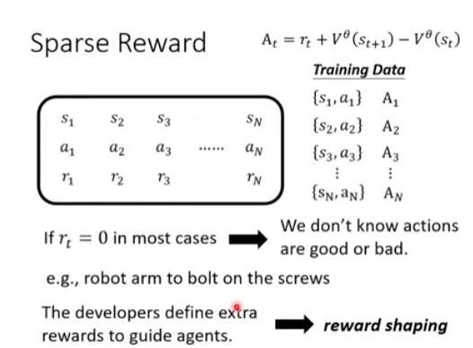

# Deep Reinforcement Learning
Supervised Learning -> RL

Example: Playing video game

# 3 Step of RL
1. Fuction with unknown
    
2. Define "loss"
    
4. Optimization
    
    WITH RANDOMNESS
# Policy gradient

## An acrion affects the subsequent observations
## Reward delay

## off-policy
## Collection Training Data: Exploration 

DeepMind  PPO
## Actor-Critic
Value function

# Reward Shaping

### VizDoom

# No Reward 
## Lmintaion Learning

### IRL
