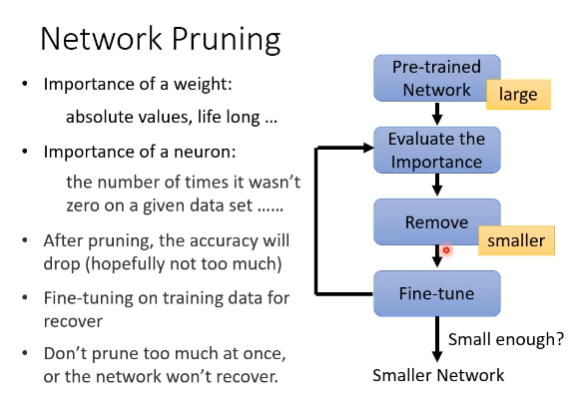
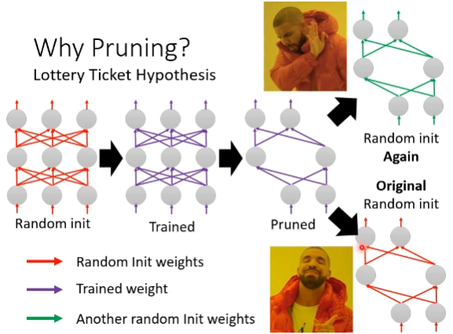
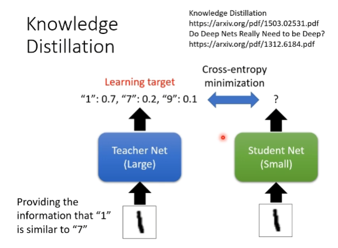

# Network Compression
## Smaller Model
## Network Prunning

### Practical Issue
1. hard to implement, hard to speed up

### Neuron pruning
### Weight pruning

### large network is eazier to optimize?
Lottery Ticket Hypothesis?

1. keep the sign is critial

# Knowledge Distillation

Ensemble

## Teacher Net
## Student Net

Temperature for softmax

# Parameter Quantiaztion
1. Using less bits to represent a value
2. Weight clustering

3. Binary Weights

# Depthwise Separable Convolution
1. Depthwise Convolution
   cnn的误解
2. Pointwise Convolution

# Dynamic Computation
1. Dynamic Depth
2. Dynamic Width
3. Computaion based on sample difficulty