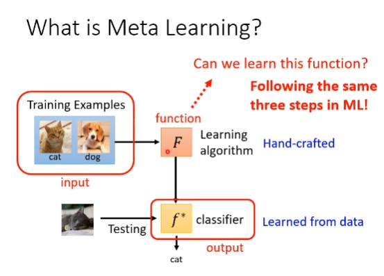
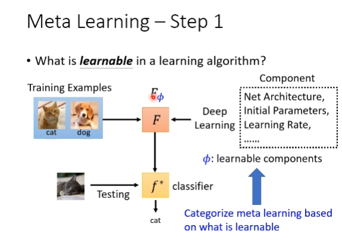
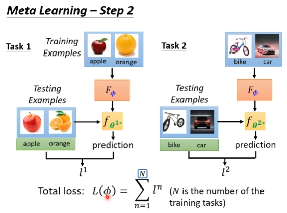
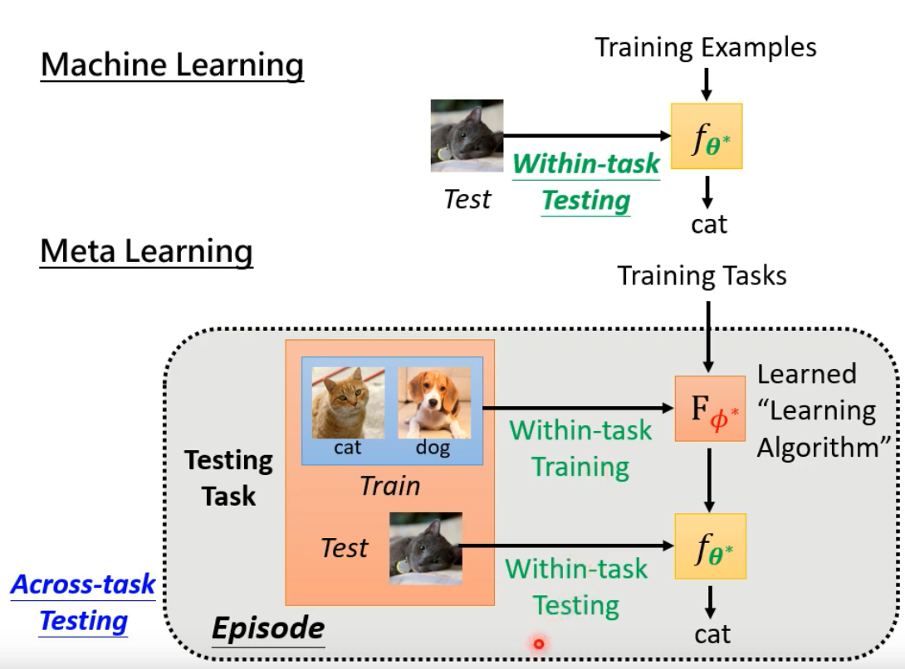
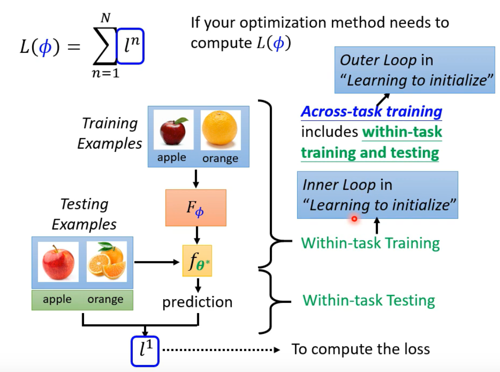

# Meta Learning
Learn to Learn

fewshot learn != meta learning

# ML vs Meta Learning
support set && querry set

# What can be learned?
1. Learning to initialize
    MAML
    MAML VS Pre-training VS Domain adaptation
2. Optimizer
3. NAS : Network Architecture Search

Beyond gradient decent

## Few-shot Image Classification