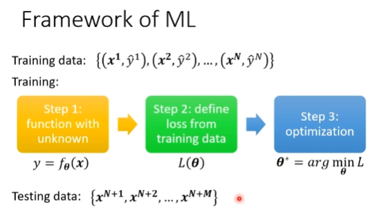
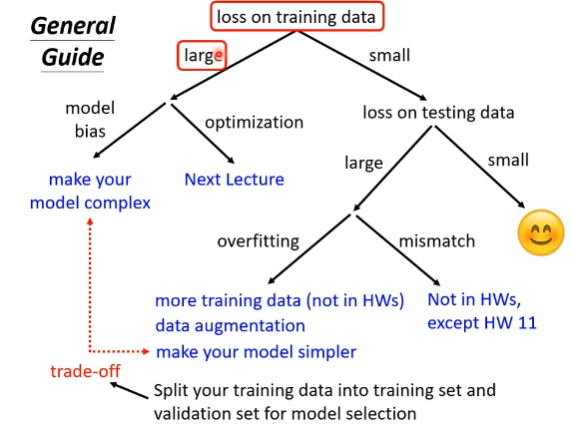
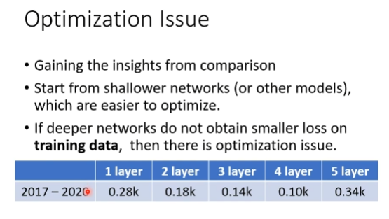
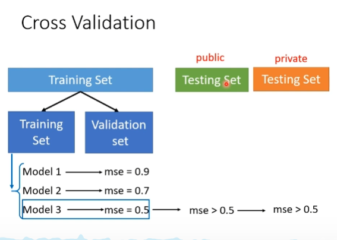
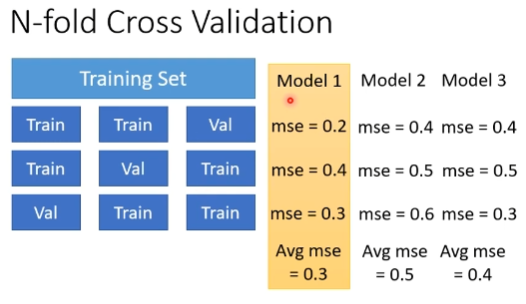
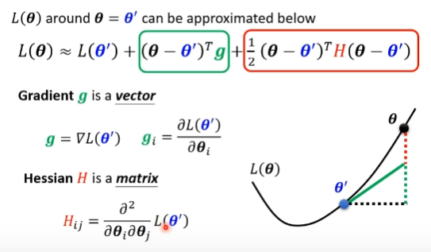
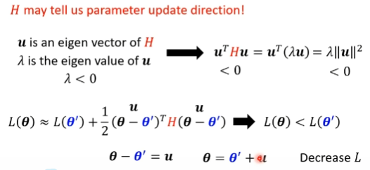

# framework ML

## model bias

## optimization issue

## 正确认识overfitting

Flexible model

1. Data augmentation
2. contrained model
   
    fully-connected  && CNN 

     

## crossvalidation
    

N-fold Cross Validation

### mismatch

# when gradient decent is small

local minima && saddle point

critical point

Tayler Series Approximation
Hessian

H may tell us paramiter update direction!

高维local minima 很少