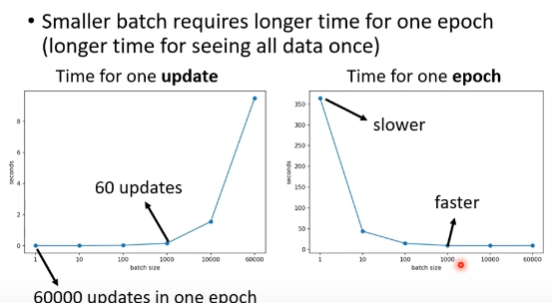
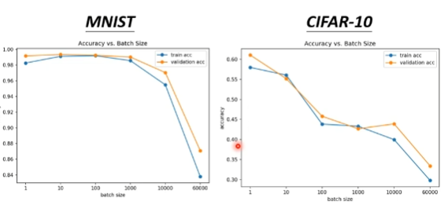
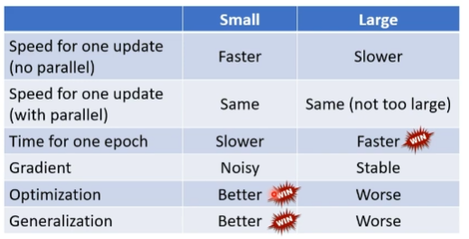
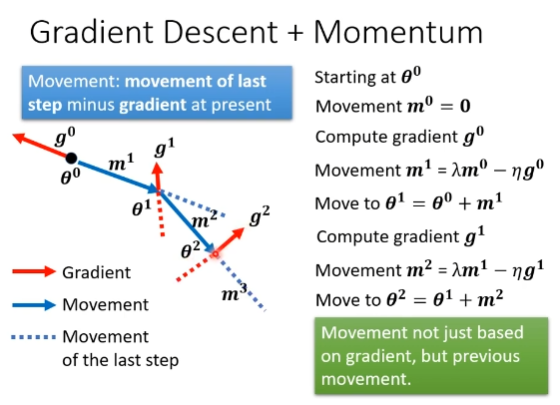

# framework ML

## model bias

## optimization issue

## 正确认识overfitting

Flexible model

1. Data augmentation
2. contrained model
   
    fully-connected  && CNN 

     

## crossvalidation

    

N-fold Cross Validation

### mismatch

# when gradient decent is small

# local minima && saddle point

critical point

Tayler Series Approximation

Hessian

H may tell us paramiter update direction!

高维local minima 很少

# Batch

1 epoch = see all the batches once

small batch v.s. large batch

small batch is better on testing data

Flat Minima && Sharp Minima

# Momentum

Gradient Descent + Momentum
