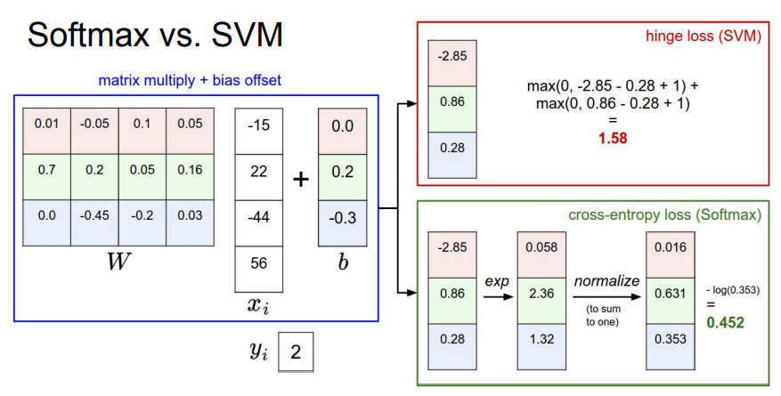
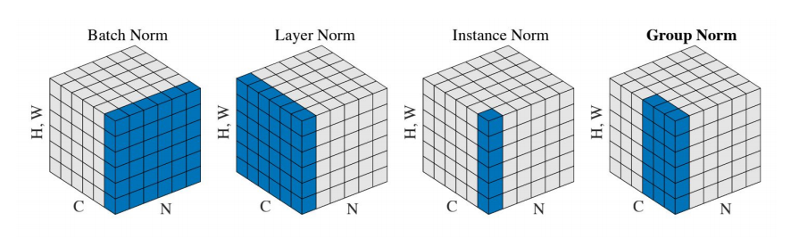
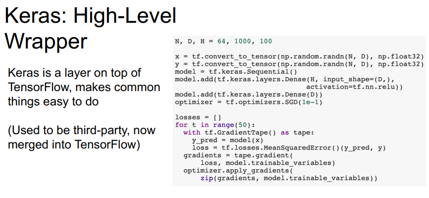
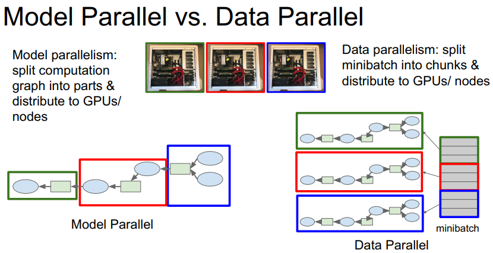
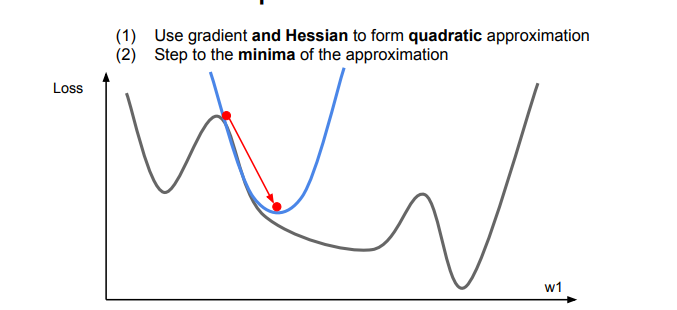
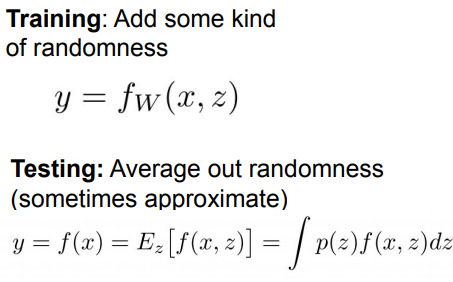
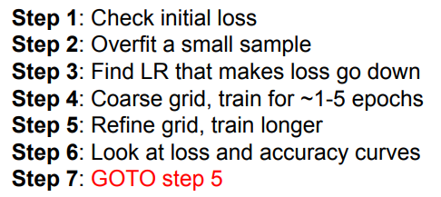

# visual recognition
1. object detection
2. image captioning
3. semantic segmentation
4. visual question answering
5. visual instruction navigation
6. scene graph generation
# image classification
1. Nearest Neighbor Classifier 
   K-Nearest Neighbors
2. Linear Classifier
# Loss Function
1. Multiclass SVM Loss
2. Softmax Classifier
   

# Activation Funtions
TLDR: In practice:
- Use ReLU. Be careful with your learning rates
- Try out Leaky ReLU / Maxout / ELU / SELU
- To squeeze out some marginal gains
- Don’t use sigmoid or tanh

# Weight Initialization

# Batch Normalization

# Computation graphs
## Dynamic Computation Graphs
## Static Computation Graphs
1. pytorch
2. tensorflow
   keras

   

# Model Parallel vs. Data Parallel

# Optimiser

## Learning rate schadual
## First-Order Optimization
## Second-Order Optimization

### L-BFGS

# Improve Test Error

## Early Stopping
## Regulariztion
1. Dropout
2. Batch Normalize
3. A common pattern
   
4. Data Augmentation
5. DropConnect(not good in practice)
6. Fractional Max Pooling(not good in practice)
7. Stochastic Depth(not good in practice)
8. Cutout/Random Crop
9. Mixup

# Choosing hyperparameters
