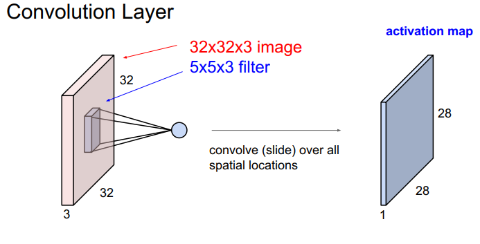
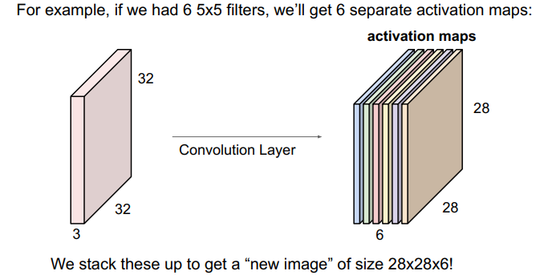
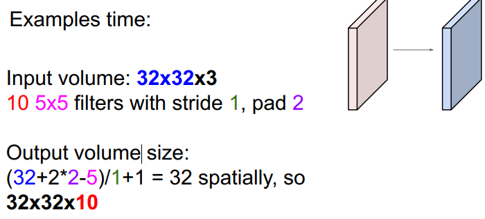
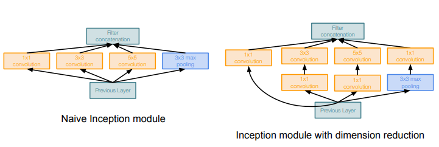
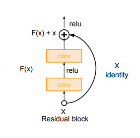
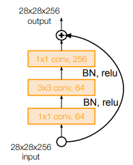

# Convolution Layer

btw, 1x1 convolution layers make perfect sense

# Pooling layer
1. max pooling

# CNN Architectures

1. AlexNet
2. VGG
3. GoogleLeNet
   inception module
   
   

   Auxiliary classification outputs to inject additional gradiant at lower layers
4. resnet
   residual connections

   
   

   1. SENet
   2. Wide Residual Networks
   3. ResNeXt
   4. DenseNet
   5. MobileNets
   6. 